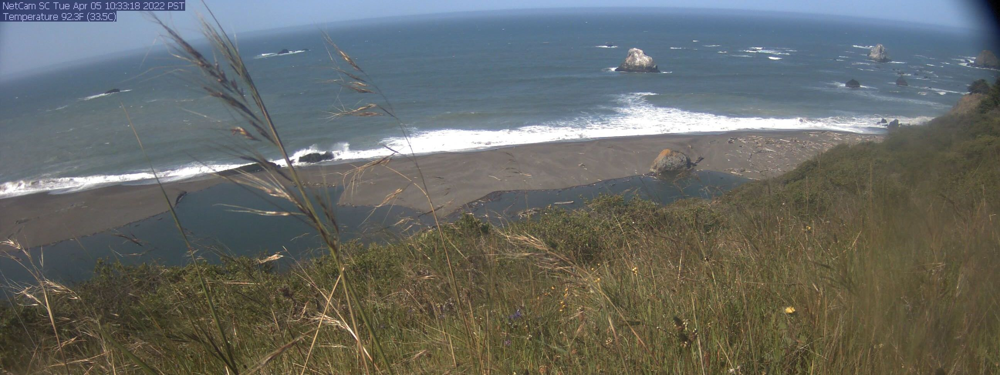

# Russian River Seepage



Mass-balance workflow for the Russian River estuary at Jenner, CA.
This repository merges hydrologic and oceanographic records
(USGS, NOAA CO-OPS, visitor-center gauge, inlet-state logs, and a stage–storage curve) to estimate seepage through the sand berm during bar-closure events.

It accompanies the manuscript *Seepage through the Sand Barrier at the Mouth of the Russian River, an Intermittently Closed Estuary* (Crompton, Behrens & Largier), whose LaTeX source lives in `overleaf/` (synced with Overleaf via git).

## Approach

During inlet closures the estuary loses water to the ocean by seepage through the sand berm.
Seepage $S$ is estimated at daily timesteps from a basin-scale water balance,

$$S = Q_r + P A_e(h) - \frac{dV}{dt},$$

where $Q_r$ is river discharge, $P A_e(h)$ is precipitation on the estuary surface, and $V(h)$ is estuary volume from a stage–storage (hypsometric) curve. Days dominated by wave overwash are filtered out by forecasting the next-day stage from river inflow; evaporation and groundwater exchange are neglected (small relative to $Q_r$).

Seepage is then modeled via Darcy's law with an effective berm conductance $C$:

$$S = C(\cdot) \Delta h, \qquad \Delta h = h - h_{\mathrm{ocn}},$$

where $h$ is estuary stage and $h_{\mathrm{ocn}}$ is ocean water level. Two conductance formulations are compared:

| Model | Equation | Parameters |
|---|---|---|
| Linear (constant $C$) | $S = C_L \Delta h$ | $C_L$ |
| Offset–power on stage $h$ | $S = C_V \zeta_V^{b_V} \Delta h$ | $C_V$, $\delta_V$, $b_V$ |

where $\zeta_V = (h + \delta_V)/m_V$ is a dimensionless scaled water level and $m_V = \mathrm{median}(h) + \delta_V$ is its median normalization, so $C_V$ equals the effective conductance at median stage. The linear model is the special case $b_V = 0$.

## Key results

Across 32 closure events (2012–2023) with at least five daily data points:

* Seepage accounts for 20–60% of river inflow during closures, with mean daily rates of 0.5–3.0 m³/s.
* Per-event linear conductance $C_L$ ranges from 0.5 to 1.5 m²/s; the pooled fit gives $S = 1.07 \Delta h$.
* AIC/BIC favor the offset–power model, but the fitted exponent is small ($b_V \approx 0.19$) and the $R^2$ gain is modest (0.45 → 0.48), so the linear model is an adequate operational approximation.
* In some years $C_L$ declines over successive closures, suggesting seasonal clogging by finer sediments; interannual variation in $C_L$ tracks changes in berm shape following winter erosion and rebuilding.

## Getting started

### Environment

```bash
conda env create -f environment.yml
conda activate russian-river-seepage
```

### Data

* **Raw data** → `data/` (API pulls or local CSV/Excel: USGS discharge, NOAA CO-OPS tides, visitor-center gauge, BML rain/webcam closure records, stage–storage curve)
* **Interim** → `data/interim/` (merged/resampled tables)
* **Processed** → `data/processed/` (event-level tables used by the model-fit notebooks)

## Notebooks

| Notebook | Description |
|---|---|
| `0 Model description - two models` | Derivation and notation for the linear and offset–power seepage models |
| `1 Russian River – merge data` | Merge and align hydrologic/oceanographic time series |
| `2 Russian River – analysis` | Mass-balance seepage estimates, overwash filtering, and per-event fits |
| `3 Seepage vs DeltaH model fits` | Linear vs offset–power model comparison with AIC/BIC and bootstrap |
| `4 Crest` | Berm crest elevation analysis |
| `Grouped_vs_Pooled_3models` | Pooled best-by-holdout-RMSE fits for the candidate models |
| `Russian River - visitor center - USGS` | Comparison of visitor-center and USGS estuary gauges |
| `Russian River – 15 min – delta h - submitted` | 15-minute Δh analysis from the submitted version |

## Repository structure

```
├── data/                 # Raw, interim, and processed data
├── figures/              # Generated figures
├── notebooks/            # Analysis notebooks
├── overleaf/             # Manuscript LaTeX source (synced with Overleaf)
├── references/           # Literature
├── scripts/              # Utility scripts (Fig 1 location map, headless notebook runner)
├── src/                  # Reusable Python modules
│   ├── seepage_analysis.py
│   ├── seepage_plots.py
│   ├── timeseries.py
│   ├── timeseries_functions.py
│   └── plot_config.py
├── environment.yml       # Conda environment specification
└── README.md
```
